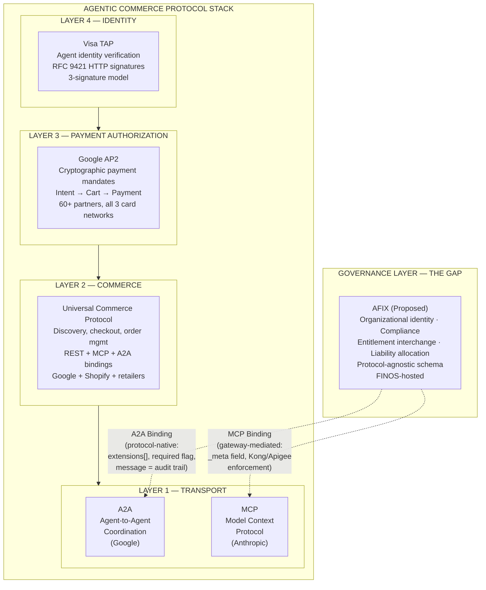

# Synthesis: Protocol Governance Surface Analysis (B.2.1)
_Date: 2026-04-20 | Status: Final_

---

## Purpose

This document synthesizes research covering the protocol surfaces that the AFIX governance schema must account for: MCP's cross-enterprise governance surface, Google's AP2/UCP commerce protocols, and Visa's Trusted Agent Protocol. The findings resolve several open design questions and reshape the binding exercise (B.2.2) and article structure.

---

## Thesis Status: AFIX Confirmed and Strengthened

The protocol-agnostic governance schema thesis is not just confirmed — it is materially strengthened by three independent lines of evidence:

1. **Bloomberg, FactSet, and LSEG independently built identical proprietary governance middleware on top of MCP** because the protocol does not carry governance metadata natively. Three of the largest finserv data providers paying the governance tax separately is the strongest market evidence that AFIX standardization is needed.MCP-4,5,6,7

2. **UCP ships the exact architectural pattern AFIX proposes** — a domain-specific protocol with REST, MCP, and A2A bindings for the same capabilities. This moves AFIX's multi-transport binding design from "proposal" to "proven pattern."AP2-2,8,9

3. **Visa's Intelligent Commerce Connect is protocol-agnostic and network-agnostic** — supports TAP, ACP, MPP, UCP, and both Visa and non-Visa cards. A major payment network building a protocol-agnostic integration layer is directional validation of the AFIX thesis.TAP-9

---

## Key Finding 1: The Four-Layer Agentic Commerce Protocol Stack

This research resolves the protocol architecture question definitively. The stack is:

| Layer | Protocol | Function | Backed By |
|-------|----------|----------|-----------|
| **Transport** | A2A / MCP | Agent coordination / Tool invocation | Google (A2A), Anthropic + community (MCP) |
| **Commerce** | UCP | Discovery, checkout, order management | Google + Shopify + retailers |
| **Payment Auth** | AP2 | Cryptographic payment mandates (Intent, Cart, Payment) | Google + 60 partners incl. all 3 card networks |
| **Identity** | TAP | Agent identity verification (RFC 9421 signatures) | Visa + Cloudflare |
| **Governance** | AFIX (proposed) | Organizational identity, compliance, entitlement, liability | FINOS (proposed) |

**Critical resolution:** AP2 and UCP are NOT the "base protocol" for agentic commerce. They ride ON TOP of A2A/MCP as transport. AFIX binds to A2A and MCP (the transports), not to AP2/UCP. They are siblings on the same transport layer, not parent-child.AP2-3,4,5

**What each protocol governs:**

- **TAP** → "Is this agent who it claims to be?" (identity — strong)
- **AP2** → "Did the user consent to this specific payment?" (payment authorization — strong)
- **UCP** → "How do agents discover products and complete purchases?" (commerce lifecycle)
- **AFIX** → "Should these organizations be interacting, under what regulatory framework, with what liability allocation?" (organizational governance — the gap)

No existing protocol answers the AFIX question. TAP gets closest (identity) but covers only one of four governance primitives.

---

## Key Finding 2: The MCP Binding Is Structurally Different from the A2A Binding

This is the most consequential technical finding for the binding exercise.

**A2A governance binding: Protocol-native.**
- Four clean attachment points: Agent Card extensions, HTTP header negotiation, task metadata, message/artifact `extensions[]` arrays
- Released, typed extension system with `required` flag enforcement
- Governance metadata travels WITH the message — the message IS the audit trail
- Pattern: "FIX-like" — governance embedded in the execution graph

**MCP governance binding: Gateway-mediated.**
- Primary attachment: untyped `_meta` field (any JSON, no schema validation, no required-field enforcement)
- Extension framework (SEP-2133) shipped with Final status — provides vendor-prefixed identifiers, bilateral capability negotiation, mandatory enforcement via server rejection
- Enforcement delegated to gateway infrastructure (Kong, Apigee, Cloudflare) rather than protocol-level rejection
- Pattern: "API economy" — governance enforced at the infrastructure boundary

**The asymmetry is the core intellectual contribution of this research.** Governance requirements are protocol-invariant (the AFIX schema is identical for both). The enforcement mechanism is protocol-specific. A2A self-documents governance. MCP delegates governance to infrastructure. Both are legitimate patterns. The schema must work with both.

**Provisional claim (flagged for stress-test):** The MCP gateway-mediated model may be easier to adopt short-term — financial institutions already operate API gateways. Adding governance rules to an existing Kong deployment is a configuration change. Adopting A2A extension negotiation requires implementing new protocol behavior. Counter: easier adoption does not mean better governance. Gateway-mediated audit trails are harder to audit than protocol-native ones. Regulators may prefer A2A's model for auditability.MCP-analyst

---

## Key Finding 3: Open-Loop Demands Protocol-Level Governance

The closed-loop vs. open-loop analysis (TAP workstream) produces a structural insight that extends beyond payments:

**Any cross-enterprise agent interaction is open-loop by definition.** When Firm A's agent interacts with Firm B's service, no single organization controls both endpoints. This is the Visa problem, not the AmEx problem.

- **AmEx ACE** = closed-loop governance through organizational authority (controls issuer, network, acquirer). The ceiling — what complete governance looks like when coordination costs are zero. Not generalizable to multi-party environments.TAP-11
- **Visa TAP** = open-loop governance through protocol authority (cryptographic proofs validated by independent participants). Incomplete but instructive — strong on identity, absent on audit and liability.TAP-1,2

**The thesis follows directly:** Open-loop environments require MORE standardization of governance primitives (identity, auth, audit, liability) and LESS standardization of governance policies (spending limits, agent acceptance, authentication thresholds). Define the data exchange format, not the decision policies. This maps exactly to AFIX's design — schema components define what metadata is exchanged, not what values are acceptable.TAP-analyst

---

## Key Finding 4: Three Finserv Data Providers Proved AFIX Is Needed

Bloomberg, FactSet, and LSEG independently built identical governance middleware categories on top of MCP:MCP-4,5,6,7

| Governance Domain | Bloomberg | FactSet | LSEG |
|------------------|-----------|---------|------|
| Identity/Auth | Proprietary middleware | Enterprise MCP security layer | Trusted AI Ready Content |
| Access Control | Entitlement enforcement | Role-based tool access | Content entitlement |
| Audit Logging | Custom metering layer | Compliance audit trails | Usage tracking |
| Rate Limiting | Traffic management | Request governance | Consumption controls |

Three firms. Same problem. Three proprietary solutions. This is the textbook case for standardization — and the strongest market evidence for AFIX. The standard is the coordination mechanism that prevents a fourth firm from building the same middleware a fourth time.

**Important framing note:** This evidence proves that governance middleware for agentic data access is universally needed in financial services, and that the governance taxonomy is convergent across independent implementations. It proves intra-ecosystem governance demand directly. The bridge to cross-enterprise interchange demand runs through the multi-hop workflow argument: when a buy-side agent chains Bloomberg data retrieval through a sell-side research agent, the governance metadata must interchange — and the triple-build shows the vocabulary already exists independently on each side. AFIX proposes the Rosetta Stone.

---

## Key Finding 5: UCP's Multi-Transport Binding Is the AFIX Precedent

UCP demonstrates the exact architectural pattern AFIX needs:AP2-2,8,9

- **Capability-based design:** Independent capabilities (Checkout, Product Discovery, Order Management) that can be implemented separately
- **Multiple transport bindings:** Each capability has REST API, MCP, and A2A bindings — same semantics, different transports
- **Extension mechanism:** Domain-specific extensions (AP2 Mandates Extension) that add capabilities without modifying core UCP
- **Profile declaration:** Discoverable endpoint where the server declares which capabilities and extensions it supports

**Design implication for AFIX:** Adopt UCP's Capability/Extension/Profile pattern. Governance capabilities (Compliance Events, Entitlement Interchange, Liability Metadata, Agent Cards) as independently versioned capabilities with A2A and MCP bindings each. Domain-specific extensions per finserv sub-domain. Profile declaration at a discoverable endpoint.AP2-analyst

---

## Key Finding 6: AP2 Mandates and AFIX Coexist on the Same Messages

AP2's three-mandate architecture (Intent, Cart, Payment) provides cryptographic proof of user authorization — genuine governance for payment transactions. But it covers NONE of: organizational identity (LEI), regulatory jurisdiction, compliance certification, entitlement interchange, or multi-hop liability allocation.AP2-1,6,7

In the ACGP pilot, AP2 and AFIX co-exist on the same A2A/MCP messages:

| Pilot Step | Transport | Commerce Protocol | AFIX Governance |
|-----------|-----------|-------------------|-------------------|
| 1. Discover merchant catalog | MCP | UCP Checkout (MCP binding) | Agent Card exchange |
| 2. Negotiate cart | A2A | UCP Checkout (A2A binding) | Entitlement verification |
| 3. User authorizes purchase | Client-side | AP2 Intent/Cart Mandate | — |
| 4. Execute payment | A2A or MCP | AP2 Payment Mandate | Compliance Event + Liability Metadata |
| 5. Post-purchase dispute | A2A | UCP Order Management | GHR + AP2 mandate evidence |

**The complementarity argument:** A payment authorized by AP2 mandates but executed between unverified organizations (no Agent Cards, no compliance attestation, no entitlement check) is a governed payment in an ungoverned relationship. The pilot exposes this gap.AP2-analyst

---

## Implications for Binding Specifications

### What this research resolves for the binding exercise:

1. **AFIX binds to A2A and MCP** — confirmed. Not to AP2/UCP. They are peer layers on the same transports.

2. **The A2A binding is clean.** Four attachment points with typed extension negotiation, `required` flag enforcement. AFIX registers as an A2A extension alongside AP2. They coexist in `extensions[]` arrays without conflict.

3. **The MCP binding requires a different approach.** SEP-2133 extension framework is shipped (Final status). Primary binding via SEP-2133 extension registration (vendor-prefixed, init-negotiated, mandatory-enforceable). `_meta` field conventions serve as backward-compatible fallback for servers not yet on SEP-2133. Gateway enforcement (Kong ACLs, custom proxy rules) provides per-request supplementary enforcement.

4. **Adopt UCP's Capability/Extension/Profile pattern** for both bindings. Each AFIX component (Agent Cards, Compliance Events, Entitlement Interchange, Liability Metadata, GHR) as an independently versioned capability.

5. **The asymmetry between bindings IS the core intellectual contribution.** Do not treat it as a problem to solve — treat it as a finding to present. Governance is a semantic layer, not a transport layer. The transport determines HOW governance is enforced. The schema determines WHAT governance means.

### Open design question for binding specifications:

**Should AFIX reference AP2 mandates in compliance events?** When a payment occurs, the Compliance Event's `authority_basis` field could reference the AP2 mandate chain — "this governance action was triggered by AP2 Intent Mandate [hash]." This creates cross-protocol traceability. Design decision required. (Resolution: `ap2_mandate_ref` was moved to the `ext/agentic-commerce` domain extension, accessed via `authorization._ext_refs` — see B.2.2 synthesis.)

---

## Original Contributions

### Technical
1. **Four-layer agentic commerce protocol stack** — Transport (A2A/MCP) → Commerce (UCP) → Payment Auth (AP2) → Governance (AFIX). Clear layer separation not documented in this form elsewhere.
2. **Asymmetric binding model** — A2A protocol-native vs. MCP gateway-mediated governance enforcement. Same schema, different enforcement. Governance as semantic layer, not transport layer.

### Analytical
3. **Bloomberg/FactSet/LSEG triple-build as standardization evidence** — three independent proprietary middleware layers proving governance middleware is universally needed.
4. **Open-loop = more primitive standardization, less policy standardization** — structural insight from closed-loop vs. open-loop analysis. Defines AFIX's design boundary: standardize the data exchange format, not the decision policies.
5. **UCP as AFIX architectural precedent** — proven multi-transport binding pattern moves AFIX from proposal to established pattern.
6. **AP2/AFIX complementarity** — governed payment in an ungoverned relationship as the gap that justifies both protocols coexisting.

---

## Source Notes

| # | Research Note | Topic |
|---|------|-------|
| 1 | MCP governance surface | MCP metadata surfaces, extension framework (SEPs), OAuth 2.1, Kong Registry, Bloomberg/FactSet/LSEG case studies |
| 2 | AP2/UCP protocol analysis | AP2 mandate architecture, UCP capabilities/bindings, protocol stack resolution, Mastercard Verifiable Intent |
| 3 | Visa TAP analysis | TAP three-signature model, closed vs open-loop analysis, Visa ICC, governance primitive coverage gap |

**Combined source count:** 79 sources across this research workstream. Majority Tier 1 (official specs, official announcements, GitHub repos).
